# 你好，我是史鸿洁 · Shi Hongjie 👋

**AI 产品经理｜AI Agent · RAG · AI Evals · AIGC · Vibe Coding**

📍 北京 · 5 年产品经验 · 近 2 年聚焦 AI 产品

我从真实业务问题出发，连接用户、模型与工程，把不确定的 AI 能力做成可审核、可验证、可落地的产品。  
I turn complex AI capabilities into practical products with evidence, guardrails, and measurable outcomes.

---

## ⭐ Selected work · 代表项目

🤖 [**CreditPulse AI**](https://github.com/hongjieshi82-crypto/creditpulse-ai)  
面向多国信贷资产风控的 Multi-Agent 系统，将指标计算、异常识别、监管政策检索与风险研报生成编排为可审核、可追溯的工作流。

📚 [**Cross-border Credit Policy RAG**](https://github.com/hongjieshi82-crypto/cross-border-credit-policy-rag)  
海外信贷政策与征信合规 RAG 评估管道，支持法律层级解析、元数据过滤、出处追溯和严格防幻觉回答。

🛡️ [**CreditPulse RiskGuard**](https://github.com/hongjieshi82-crypto/CreditPulse-RiskGuard)  
多语种金融风控内容控制系统，通过 Few-shot、推理审计与确定性校验，约束关键指标和跨语种术语中的幻觉。

🧭 [**AI Product Workbench**](https://github.com/hongjieshi82-crypto/ai-product-workbench)  
面向产品经理的目标、需求、任务、排期、Badcase 与 Case 聚类管理工作台。

🎲 [**粗去玩鸭 · AI 旅行盲盒**](https://github.com/hongjieshi82-crypto/chuquwanya)  
基于出发地、时间、预算与心情，通过硬约束过滤、候选召回与解释生成，只给用户一个当下可执行的周末方案。  
[体验产品](https://hongjieshi82-crypto.github.io/chuquwanya/)

☕ [**Coffee-Dex · 职场咖啡图鉴**](https://github.com/hongjieshi82-crypto/Coffee-Dex)  
独立完成产品设计、AI 识别与开发上线，用图鉴收集和职场幽默打造轻量记录体验。  
[体验产品](https://coffee-dex.vercel.app)

---

## 📈 Impact · 已验证成果

| 场景 | 结果 |
|---|---|
| CreditPulse 风控报告 | **5–7 天 → 24 小时内** |
| 法条检索 Top 5 命中率 | **68% → 92%** |
| AIGC 素材生产 | **10+ 张/天 → 40 张/天** |
| AIGC Logo 交付 | **5 天 → 1 天** |
| Coffee-Dex | **8 大分类 · 3,127 条文案** |
| 粗去玩鸭 | **41 个 API 测试 · 22 个 Web 路由** |

---

## 🧩 How I work · 产品方法

1. **找对问题** — 用户研究、场景拆解与机会判断
2. **设计系统** — Agent 工作流、RAG、AI 评测与回归
3. **推动落地** — 0→1、跨团队协作与风险控制
4. **验证价值** — 指标设计、实验迭代与业务闭环

我关注的不只是一次回答是否正确，而是如何让 AI 产品具备可靠依据、受控编排、规则拦截与人工接管能力。

---

## 💼 Experience · 经历

- **AI 产品经理 · 海外金融科技**｜北京一帆一路信息技术有限公司｜2022.09–2026.08
- **产品经理 · 智慧文旅数字化**｜北京活动时文化传媒有限公司｜2021.04–2022.08
- **交互设计师 · 金融产品体验**｜美团金融服务设计中心｜2020.03–2020.12

---

## ✍️ Writing · 持续输出

我持续记录 AI 产品实践、Agent、工具体验与产品成长。

- [人人都是产品经理 · 公开文章](https://www.woshipm.com/u/1682045)
- 公众号：**怂怂的 AI 脑内小剧场**

---

## Contact

- ✉️ [hongjieshi82@gmail.com](mailto:hongjieshi82@gmail.com)
- 📱 [+86 134 3683 0802](tel:+8613436830802)

---

> AI 产品经理的价值，是把不确定的智能变成可交付的确定性。
